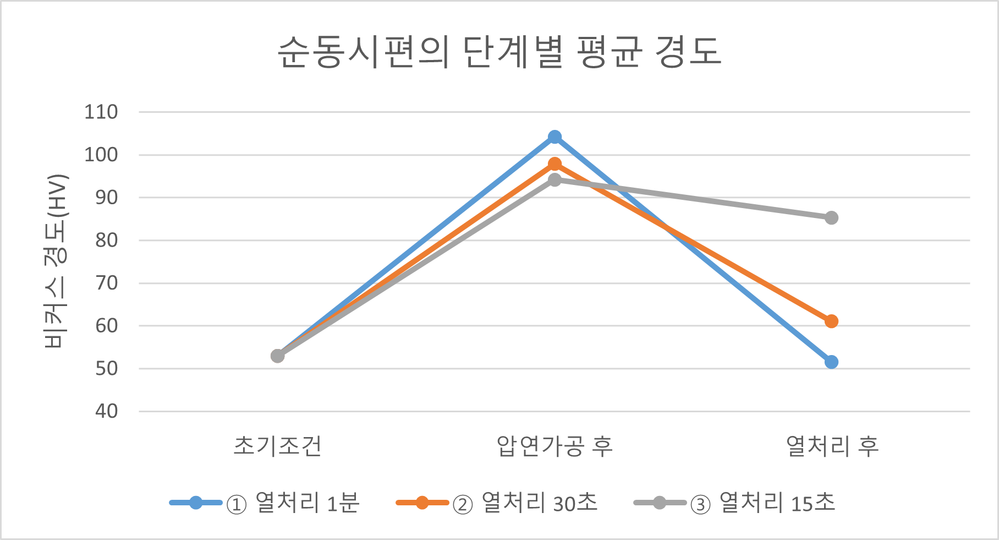

# 구리 시편의 경도 변화

## 표 1. 1분 열처리 (800℃) 조건에서의 경도 변화
| 시편   | 초기조건 |  압연 후  | 열처리 후 |
|:-------|---------:|-----------:|----------:|
| 시편-1 |       53 |        107 |      45.4 |
| 시편-2 |       53 |      102.1 |      52.1 |
| 시편-3 |       53 |      103.6 |        57 |
|**평균**|       53 |    104.233 |      51.5 |

## 표 2. 30초 열처리 (800℃) 조건에서의 경도 변화
| 시편   | 초기조건 |  압연 후  | 열처리 후 |
|:-------|---------:|-----------:|----------:|
| 시편-4 |       53 |       96.4 |      63.1 |
| 시편-5 |       53 |       92.2 |      65.7 |
| 시편-6 |       53 |        105 |      54.3 |
|**평균**|       53 |     97.867 |    61.033 |

## 표 3. 15초 열처리 (800℃) 조건에서의 경도 변화
| 시편   | 초기조건 |  압연 후  | 열처리 후 |
|:-------|---------:|-----------:|----------:|
| 시편-7 |       53 |       86.5 |      70.2 |
| 시편-8 |       53 |       79.6 |      70.2 |
| 시편-9 |       53 |      117.2 |     106.6 |
| 시편-10|       53 |       93.5 |      94.3 |
|**평균**|       53 |       94.2 |    85.325 |

## 표 4. 시편별 두께 변화와 압연률
| 시편    | 초기 두께 | 압연 후 두께 | 압연률 (%) |
|:--------|----------:|-------------:|-----------:|
| 시편-1  |      2.05 |         1.40 |     31.71 |
| 시편-2  |      1.60 |         1.30 |     18.75 |
| 시편-3  |      1.50 |         1.10 |     26.67 |
| 시편-4  |      2.00 |         1.70 |     15.00 |
| 시편-5  |      0.11 |         0.10 |      9.09 |
| 시편-6  |      1.60 |         1.30 |     18.75 |
| 시편-7  |      2.00 |         1.65 |     17.50 |
| 시편-8  |      1.45 |         1.30 |     10.34 |
| 시편-9  |      2.00 |         1.35 |     32.50 |
| 시편-10 |      2.10 |         1.65 |     21.43 |
| **평균**|     1.641 |        1.285 |     21.69 |

## 그림 1. 구리 시편의 단계별 평균 경도

